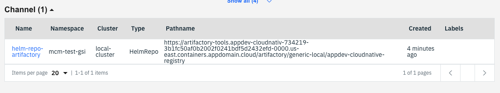
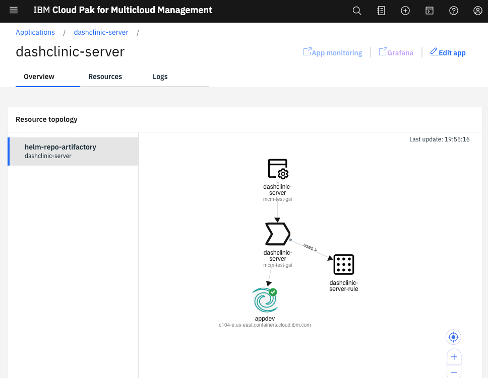
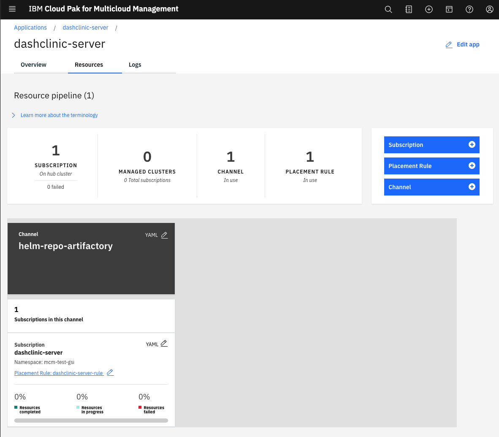
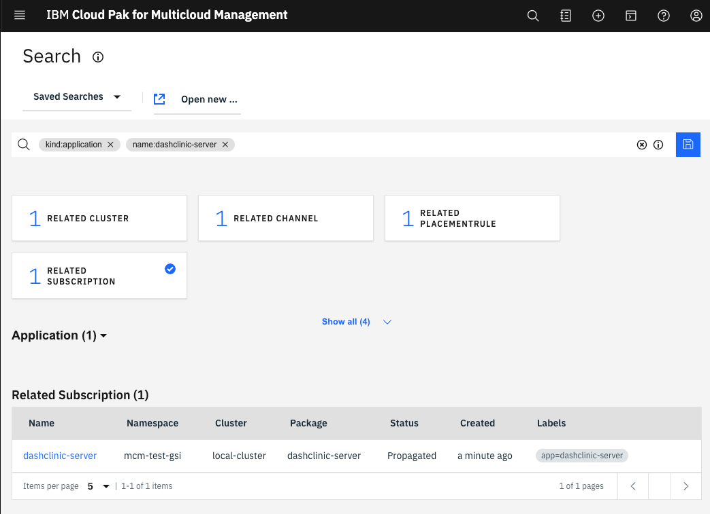

## Continuous Delivery with IBM Multi Cloud Manager

The IBM Cloud Pak™ for Multicloud Management, running on Red Hat® OpenShift®, provides consistent visibility, governance and automation from on premises to the edge. Enterprises gain capabilities such as multicluster management, event management, application management and infrastructure management. Enterprises can leverage this IBM Cloud Pak to help increase operational efficiency that is driven by intelligent data analysis and predictive golden signals, and gain built-in support for their compliance management.

This app template will help you understand how you can deploy your CI built
 applications into IBM Multi Cloud Manager.

### Define Channel to a Helm Repository

Channels point to repositories where Kubernetes resources are stored, such as a namespace, object store, or Helm repository. Channels use deployable resources to represent stored Kubernetes resources and Helm charts.

The first activity to deploy an application created with the Cloud Native
 Toolkit is to define a Channel to the Help Repository.

You can do this using the simple script in this folder called `channel.sh
` You need to provide the Namespace where the Custom Resource Definition will
 be defined and the URL to the Helm Reposistory include the subfolder where
  the `index.yaml` is managed in Artifactory.

```
./channel.sh {NAMESPACE} {HELM_REPOSITORY}
```

The follow is an example of defining an MCM Channel to the Helm Repositoy
. For this example we are using Artifactory.

```
./channel.sh mcm-test-gsi https://artifactory-tools.appdev-cloudnativ-734219-3b1fc50af0b2002f0241bdf5d2432efd-0000.us-east.containers.appdomain.cloud/artifactory/generic-local/appdev-cloudnative-registry
```

Once the Channel is defined you can navigation to **Manage Application
->Resources** Then click on **Channel** you will see the channel now defined
 in the list below. 



### Define Subscriptions and Deploy Rules

Subscriptions identify deployables within channels by using annotations
, labels and versions. Then, the subscription places the deployables (template or referenced Helm chart) on the subscribed target clusters. Placement rules define the target clusters where subscriptions are delivered.

To enable the deployment of 


```
./mcm-app.sh {APP_NAME} {NAMESPACE} {VERSION} {CLUSTER}
```

Here is an example of defining the App definition in MCM

```
./mcm-app.sh dashclinic-server 1.1.16 mcm-test-gsi appdev
```

After the registration is successful you can navigate to **Manage
 Applications** view and you will see the application defined. If you open
  the application view you will see the overview. 



To view the resources that have be defined click on the **Resource** tab 



To see the App Subscription click on the **Subscription**



### Summary

Use these scripts you can easiely define the resource required in IBM Multi
 Cloud Manager to define a Channel to your Help Repository, the Application
  , Subscription and the Placement Rule to define what Application and where
   you want to deploy it. This gives you the start of managing applications
    with IBM Multi Cloud Manager.


